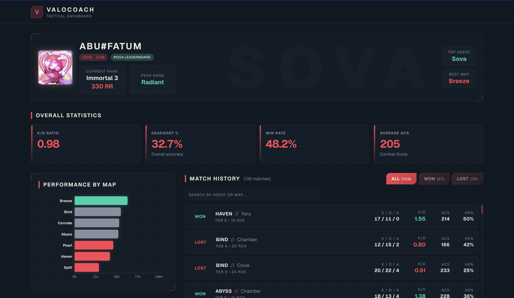

# ValoCoach — Valorant Player Dashboard

A tactical, gaming-themed dashboard for visualizing Valorant player statistics and match history. Built with Next.js 16, React 19, and TypeScript.



---

## 🚀 Setup Instructions

### Prerequisites
- Node.js 18+ 
- pnpm (recommended) or npm

### Installation

```bash
# Clone the repository
git clone https://github.com/yourusername/valocoach.git
cd valocoach

# Install dependencies
pnpm install

# Start development server
pnpm dev
```

Open [http://localhost:3000](http://localhost:3000) to view the dashboard.

### Build for Production

```bash
pnpm build
pnpm start
```

---

## ✨ Features Implemented

### Core Features
- **Player Profile Card** — Displays player name, rank, account level, and avatar with glow effects
- **Overall Statistics** — K/D ratio, Headshot %, Win Rate, and ACS in a visual stat grid
- **Match History List** — Scrollable list with map, agent, result, K/D, ACS, HS%, and date
- **Filtering System** — Filter matches by Won/Lost/Draw/All with animated buttons

### Bonus Features
- **Data Visualization** — Bar chart showing win rate by map (color-coded by performance)
- **Search** — Search matches by agent or map name
- **Match Detail Modal** — Click any match to see detailed stats (shot breakdown, damage report)
- **Animations** — Framer Motion hover effects on cards and buttons
- **Responsive Design** — Mobile-first layout with adaptive grids
- **Tactical UI Theme** — Glassmorphism, scanline overlays, corner accents, diagonal cut buttons

### Technical Highlights
- **React 19 + React Compiler** — Automatic memoization, no manual useMemo needed
- **TypeScript** — Full type safety with strict interfaces
- **shadcn/ui** — Dialog, Badge, Card, Chart components
- **CSS Design System** — Custom Valorant color palette with CSS custom properties

---

## 🧩 Challenges & Solutions

### 1. Valorant Aesthetic Without Design Mockups
**Challenge:** Creating an authentic gaming UI without Figma designs.  
**Solution:** Studied Valorant's in-game UI and tracker sites. Built a CSS design system with tactical classes (`.glass-card`, `.tactical-btn`, `.corner-accent`) that could be reused across components.

### 3. Chart Readability on Mobile
**Challenge:** Vertical bar chart was cramped on small screens.  
**Solution:** Switched to horizontal layout with adjusted margins and responsive container.

### 4. Type-Safe Result Styling
**Challenge:** Keeping Won/Lost/Draw colors consistent across components.  
**Solution:** Created `lib/result-styles.ts` with typed `Record<Match["result"], string>` mappings for both badge and text variants.

---

## ⏱️ Time Spent

| Phase | Time |
|-------|------|
| Planning & Research | ~1 hour |
| Core Features (Profile, Stats, Match List, Filters) | ~2 hours |
| Bonus Features (Chart, Modal, Search, Animations) | ~2 hours |
| Styling & Polish | ~2 hours |
| Responsive Fixes & Testing | ~1 hour |
| **Total** | **~8 hours** |

---

## 🛠️ Tech Stack

| Category | Technology |
|----------|------------|
| Framework | Next.js 16 (App Router) |
| Language | TypeScript |
| Styling | Tailwind CSS 4 |
| UI Components | shadcn/ui, Radix UI |
| Charts | Recharts |
| Animations | Framer Motion |

---

## 📁 Project Structure

```
valocoach/
├── app/
│   ├── page.tsx          # Main dashboard page
│   ├── layout.tsx        # Root layout with Navbar
│   └── globals.css       # Design system & theme
├── components/
│   ├── player-profile-card.tsx
│   ├── stats-overview.tsx
│   ├── match-history.tsx
│   ├── match-card.tsx
│   ├── match-detail-modal.tsx
│   ├── performance-chart.tsx
│   └── ui/               # shadcn components
├── lib/
│   ├── data.ts           # Data fetching & utilities
│   ├── result-styles.ts  # Result color mappings
│   └── utils.ts          # Tailwind merge helper
├── types/
│   └── player.ts         # TypeScript interfaces
└── public/
    └── data/player.json  # Player data (139 matches)
```

---
